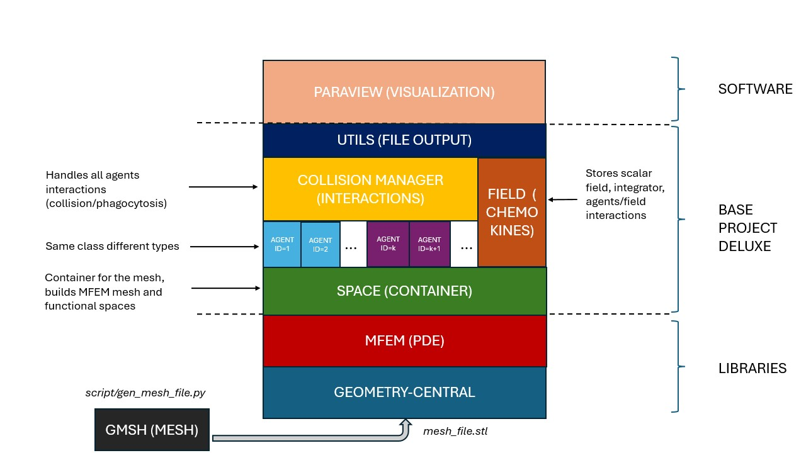

# BASE PROJECT DELUXE

This project is a basic example of an hABM (agents + PDEs) simulation, where "good" cells scan a 2D-surface (defined by a planar mesh) using BPRW (see [link](https://varennes.github.io/bprw/)), in search of "evil" cells. The good cells are guided by chemical signals (chemokines) released by evil cells.

Example of a simulation on a planar surface:


## LIBRARIES & DEPENDENCIES
This project uses the following libraries:

- [geometry-central](https://geometry-central.net/) for intrinsic geodesic agent motion and surface metrics
- [gmsh](https://gmsh.info/) to create meshes (using the Python wrapper)
- [MFEM](https://mfem.org/) for solving PDEs
- [ParaView](https://www.paraview.org/) for visualizing simulation outputs

## INSTALLATION & RUNNING
(The following steps are for Ubuntu)

Basic requirements:
```bash
sudo apt install git g++ cmake
```

Install gmsh:
```bash
sudo apt install gmsh libgmsh-dev
```

Install MFEM:
```bash
sudo apt install libmfem-dev
```

Install geometry-central dependencies:
```bash
sudo apt install libeigen3-dev libsuitesparse-dev
```

Install geometry-central from source:
```bash
git clone --recurse-submodules https://github.com/nmwsharp/geometry-central.git && cd geometry-central
mkdir build && cd build
cmake ..
make -j4
```

Compile Base_Project_Deluxe:
```bash
git clone https://github.com/PiSimo/Base_Project_Deluxe.git && cd Base_Project_Deluxe
mkdir build && cd build
cmake ..
make -j4
```

Running:
```bash
./Base_Project_Deluxe
```
the output files will be saved in <code>output/</code>.
## OVERVIEW


more details [here](project_overview.ipynb).

